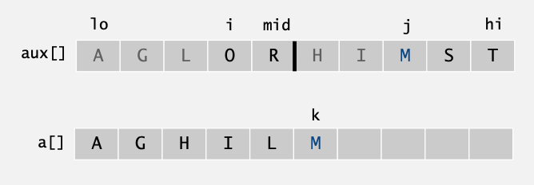

# Algorithms IV


## Lecture 4: Mergesort


### 1. Mergesort

#### 1.1 Process

- Divide array into two halves.
- **Recursively** sort each half.
- Merge two halves.


#### 1.2 Abstract in-place merge

**Goal**: Given two sorted subarrays `a[lo]` to `a[mid]` and `a[mid+1]` to `a[hi]`, replace with sorted subarrays `a[lo]` to `a[hi]`.


#### 1.3 Merge implementation

```java
private static void merge(Comparable[] a, Comparable[] aux, int lo, int mid, int hi)
{
  	for (int k = lo; k <= hi; k++)
      	aux[k] = a[k];	// copy
  	
  	int i = lo, j = mid+1；
    for (int k = lo; k <= hi; k++)
    {		// merge
      	if 			(i > mid)		a[k] = aux[j++];
      	else if (j > hi)  			a[k] = aux[i++];
      	else if (less(aux[j], aux[i]))  a[k] = aux[j++];
      	else  						a[k] = aux[i++];
    }
}
```


|  |
| :---------------------------------------------------------: |
|                 **Fig 4.1** Merge operation                 |


#### 1.4 Mergesort implementation

```java
public class Merge
{
  	private static void merge(...)
    {	/* as before */ }
  	
  	private static void sort(Comparable[] a, Comparable[] aux, int lo, int hi)
    {
      	if (hi <= lo) return;
      	int mid = lo + (hi - lo) / 2;
      	sort(a, aux, lo, mid);
      	sort(a, aux, mid+1, hi);
      	merge(a, aux, lo, mid, hi);
    }
  
  	public static void sort(Comparable[] a)
    {
      	Comparable[] aux = new Comparable[a.length];
      	sort(a, aux, 0, a.length - 1);
    }
}
```


|  |
| :----------------------------------------------------------: |
|               **Fig 4.2** Mergesort operation                |


#### 1.5 Performance analysis

Mergesort uses $\leq N\lg N$ **compares** to sort an array of length *N*.

- Number of compares $C(N)$ to mergesort an array of length *N* satisfies:

$$
C(N) \leq c([N/2])+C([N/2])+N \ \ \forall \ N>1, C(1)=0 
$$

​	where each represents the operations on the left/ right half and the merge.

- We solve the recurrence when *N* is a **power of 2**, if $D(N)$ satisfies: 

$$
D(N)=2D(N/2)+N \ \ \forall \ N>1, D(1)=0
$$


|  |
| :----------------------------------------------------------: |
|   **Fig 4.3** Divide-and-conquer recurrence of merge sort    |


Mergesort uses $\leq 6N\lg N$ array accesses to sort an array of length *N*.

- Number of array accesses $A(N)$ satisfies the recurrence:

$$
A(N)\leq A([N/2])+A([N/2])+6N \ \ \forall \ N>1, A(1) = 0
$$


#### 1.6 Linearithmic performance algorithms

Any algorithm with the following structure takes $N\log N$ time:

```java
public static void linearithmic(int N)
{
	if ( N==0 ) return;
	linearithmic(N/2);		// solve two problems
	linearithmic(N/2);		// of half the size
	linear(N);				// do a linear amount of work
}
```

**Example**:

- Fast Fourier transform.
- Hidden-line removal.
- Kendall-Tau distance.


#### 1.7 Practical improvements

1. Use **insertion sort** for small subarrays.
   - Mergesort has too much overhead for tiny subarrays.
   - Cutoff to insertion sort for subarrays with less than 10 items.

```java
private static void sort(Comparable[] a, Comparable[] aux, int lo, int hi)
{
    if (hi <= lo + CUTOFF - 1)
    {
        Insertion.sort(a, lo, hi);
        return;
    }
    int mid = lo + (hi - lo) / 2;
    sort(a, aux, lo, mid);
    sort(a, aux, mid, hi);
    merge(a, aux, lo, mid, hi);
}
```


2. Stop mergesort if subarray already sorted.
   - Check if the largest item in 1st half $\leq$ the smallest item in 2nd half.
   - Helps for partially-ordered arrays.

```java
private static void sort(Comparable[] a, Comparable[a] aux, int lo, int hi)
{
    if (hi <= lo) return;
    int mid = lo + (hi - lo) / 2;
    sort(a, aux, lo, mid);
    sort(a, aux, mid, hi);
    if (!less(a[mid+1], a[mid])) return;
    merge(a, aux, lo, mid, hi);
}
```


3. Eliminate the copy to the auxiliary array.
   - Save time but not space.
   - Switch the role of the input and auxiliary array in each recursive call.

```java
private static void merge(Comparable[] a, Comparable[] aux, int lo, int mid, int hi)
{
    int i = lo, j = mid+1;
    for (int k = lo; k <= hi; k++)
    {	// merge from a[] to aux[]
        if (i > mid)		aux[k] = a[j++];
        else if (j > hi)	aux[k] = a[i++];
        else if (less(a[j], a[i]))	aux[k] = a[j++];
        else 				aux[k] = a[i++];
    }
}

private static void sort(Comparable[] a, Comparable[] aux, int lo, int hi)
{	// assuming aux[] is initialised to a[] once before
    if (hi <= lo) return;
    int mid = lo + (hi - lo) / 2;
    sort(aux, a, lo, mid);
    sort(aux, a, mid, hi);
    merge(a, aux, lo, mid, hi);	// switch roles of aux[] and a[]
}
```

