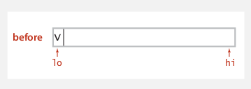
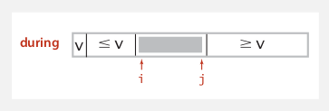
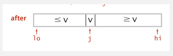
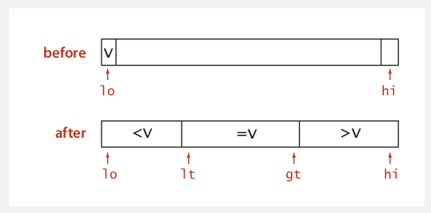

# Algorithms IV


## Lecture 5: Quick sort


### 1. Quicksort

#### 1.1 Overview

- Step 1: Shuffle the array.
- Step 2: Partition the array so that for some `j`:
  - Entry `a[j]` is in place.
  - No larger entry to the left of `j`.
  - No smaller entry to the right of `j`.

- Step 3: Sort each subarray recursively.


#### 1.2 Process

Repeat until `i` and `j` pointers cross:

- Scan `i` from left to right so long as `a[i] < a[lo]`.
- Scan `j` from right to left so long as `a[j] > a[lo]`.
- **Exchange** `a[i]` with `a[j]`.

When pointers cross:

- Exchange `a[lo]` with `a[j]`.


#### 1.3 Partitioning

```java
private static int partition(Comparable[] a, int lo, int hi)
{
    int i = lo, j = hi + 1;
    while (true)
    {
        while (less(a[++i], a[lo]))
            if (i == hi)	break;		// find item on left to swap
        while (less(a[lo], a[--j]))
            if (j == lo)	break;		// find item on right to swap
        
        if (i >= j)			break;		// check if pointers cross
        exch(a, i, j);					
    }
    exch(a, lo, j);						// swap with partitioning item
    return j;							// return index of item known to be in place
}
```


|  |  |  |
| ------------------------------------------------------------ | :----------------------------------------------------------: | ------------------------------------------------------------ |
|                                                              |              **Fig 5.1** Partitioning the array              |                                                              |


#### 1.4 Implementation

```java
public class Quick
{
    private static int partition(Comparable[] a, int lo, int hi)
    {	/* private */	}
    
    private static void sort(Comparable[] a, int lo, int hi)
    {
        if (hi <= lo)	return;
        int j = partition(a, lo, hi);
        sort(a, lo, j-1);
        sort(a, j+1, hi);
    }
    
    public static void sort(Comparable[] a)
    {
        StdRandom.shuffle(a);		// shuffle for performance guarantee
        sort(a, 0, a.length - 1);
    }
}
```


#### 1.5 Implementation details

1. Partitioning in-place

   Using an extra array makes partitioning easier and stable, but is not worth the cost.

2. Terminating the loop

   Testing wheter the pointers cross is trickier than it might seem.

3. Equal keys

   When duplicates are present, it is better to stop scans on keys equal to the partitioning item's key.

4. Preserving randomness

   Shuffling is needed for performance guarantee.

5. Equivalent alternative

   Pick a random partitioning item in each subarray.


#### 1.6 Performance analysis

- **Best case**: # of compares is $\sim n\lg n$.
- **Worst case**: # of compares is $\sim\frac 1 2 n^2$.

- **Average case**: # of compares is $\sim 1.39n\ln n$.
  - 39% more than mergesort.
  - Faster than mergesort in practice because of less data movement.


#### 1.7 Properties

- Quicksort is an **in-place** sorting algorithm.
  - Partitioning: constant extra space.
  - Depth of recursion: logarithmic extra space.
- Quicksort is not stable.


#### 1.8 Practical improvements

1. Insertion sort small subarrays
   - Even quicksort has too much overhead for tiny subarrays.
   - Cutoff to insertion sort for about less than 10 items.

```java
private static void sort(Comparable[] a, int lo, int hi)
{
	if (hi <= lo + CUTOFF - 1)
	{
		Insertion.sort(a, lo, hi);
		return;
	}
	int j = partition(a, lo, hi);
	sort(a, lo, j-1);
	sort(a, j+1, hi);
}
```


2. Median of sample
   - Best choice of pivot item is **median**.
   - Estimate true median by taking median of samples.
   - Median-of-3 random items.

```java
private static void sort(Comparable[] a, int lo, int hi)
{
	if (hi <= lo) return;
	int median = medianOf3(a, lo, lo + (hi - lo)/2, hi);
	swap(a, lo, median);
	int j = partition(a, lo, hi);
	sort(a, lo, j-1);
	sort(a, j+1, hi);
}
```


## 2. Quick select

#### 2.1 Goal

Given an array of *n* items, find the $k^{th}$ smallest item.

**Example**:

- Min - `k=0`.
- Max - `k=n-1`.
- Median - `k=n/2`.


#### 2.2 Process

Partition the array so that:

- Entry `a[j]` is in place.
- No larger entry to the left of `j`.
- No smaller entry to the right of `j`.

Repeat in **one** subarray, depending on `j`; finished when `j` equals `k`.


```java
public static Comparable select(Comparable[] a, int k)
{
    StdRandom.shuffle(a);
    int lo = 0, hi = a.length - 1;
    while (hi > lo)
    {
        int j = partition(a, lo, hi);
        if		(j < k) lo = j + 1;
        else if (j > k) hi = j - 1;
        else		   return a[k];
    }
    return a[k];
}
```


#### 2.3 Mathematical analysis

Quick-select takes **linear** time on average.

- Each partitioning step splits array approximately in half:

$$
n+n/2+n/4+\cdots+1\sim 2n \ \text{compares}
$$

- Analysis similar to quicksort yields:

$$
C_n = 2n + 2k\ln (n/k) +2(n-k)\ln(n/(n-k)) \\ \leq (2+2\ln2)n
$$


## 3. Duplicate keys

#### 3.1 Overview

Often, purpose of sort is to bring items with equal keys together.

- Sort population by age.
- Remove duplicates from mailing list.
- Sort job applicant by college attended.

Typical characteristics of such applications:

- Huge length of array.
- Small number of key values.


#### 3.2 Stop on equal keys

1. Don't stop scans on equal keys - **bad**.
   - $\sim\frac 12 n^2$ compares when all keys equal.
2. Stop scans on equal keys - **Good**.
   - $\sim n\lg n$ compares when all keys equal.
3. Put all equal keys in place - **Better**.
   - $\sim n$ compares when all keys equal.


#### 3.3 Dijkstra 3-way partitioning

**Goal**: Partition array into *three* parts so that:

- Entries between `lt` and `gt` equal to the partition item.
- No larger entries to the left of `lt`.
- No smaller entries to the right of `gt`.


|  |
| :----------------------------------------------------------: |
|            **Fig 5.2** 3-way partitioning problem            |


#### 3.4 3-way partitioning process

Let `v` be partitioning item `a[lo]`.

Scan `i` from left to right.

- If `a[i] < v`: exchange `a[lt]` with `a[i]`; increment both `lt` and `i`.

- If `a[i] > v`: exchange `a[gt]` with `a[i]`; decrement `gt`.

- If `a[i] == v`: increment `i`.


#### 3.5 3-way partitioning implementation

```java
private static void sort(Comparable[] a, int lo, int hi)
{
	if (hi <= lo) return;
	int lt = lo, gt = hi;
	Comparable v = a[lo];
	int i = lo;
	while (i <= gt)
	{
        int cmp = a[i].compareTo(v);
        if
        (cmp < 0) exch(a, lt++, i++);
        else if (cmp > 0) exch(a, i, gt--);
        else			  i++;
    }
    
    sort(a, lo, lt - 1);
    sort(a, gt + 1, hi);
}
```


#### 3.6 Lower bound

If there are *n* distinct keys and $i^{th}$ one occurs $x_i$ times, then any compare-based sorting algorithm must use at least
$$
\lg(\frac {N!}{x_1!x_2!\cdots x_n!}) \sim -\sum_{i=1}^nx_i\lg \frac{x_i}{N}
$$
compares in the worst case.


## 4. Sorting summary

|             |   inplace?   |   stable?    |      best       |   average   |     worst     |                 remarks                 |
| :---------: | :----------: | :----------: | :-------------: | :---------: | :-----------: | :-------------------------------------: |
|  selection  | $\checkmark$ |              |   $1/2 \ n^2$   | $1/2 \ n^2$ |  $1/2 \ n^2$  |              *n* exchanges              |
|  insertion  | $\checkmark$ | $\checkmark$ |        n        | $1/4 \ n^2$ |  $1/2 \ n^2$  | used for small *n* or partially ordered |
|    shell    | $\checkmark$ |              |  $n \log_3 n$   |      ?      | $c \ n^{3/2}$ |      tight code with subquadratic       |
|    merge    |              | $\checkmark$ | $1/2 \ n \lg n$ |   n lg n    |    n lg n     |         stable n lg n guarantee         |
|   timsort   |              | $\checkmark$ |        n        |   n lg n    |    n lg n     |      improved for preexiting order      |
|    quick    | $\checkmark$ |              |     n lg n      |   2n ln n   |  $1/2 \ n^2$  |           fastest in practice           |
| 3-way quick | $\checkmark$ |              |        n        |   2n ln n   |  $1/2 \ n^2$  |       improved for duplicate keys       |
|      ?      | $\checkmark$ | $\checkmark$ |        n        |   n lg n    |    n lg n     |               holy grail                |

